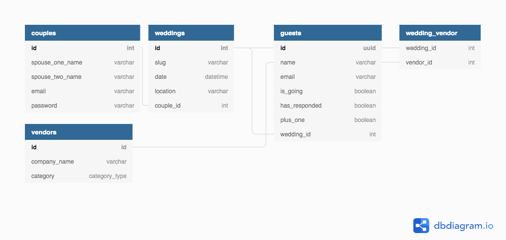

## Background

**Pitch**

Allows users to interactively manage and view, in real time, guests lists, invitation status, and gift registry.

**MVP**

## Guest Tabs

- Announcement Section
  - Each announcement contains
    - Heading
    - Sub Heading
    - Text Body
- Invitation (toggle RSVP status)
  - Togglable RSVP status viewable anywhere on site
- Registry Tab (boxes with links to sites with registries)

## Admin Tabs

- Invitation Tab (editable)
- Registry Tab (editable)
- Announcement Section
  - Immediate updates that are sent via communication settings that the user set, also viewable on the website
- Guest RSVP page
  - Color coded based on status
  - Manual user addition and status

Individualized web links for each couple that signs up

**Stretch Goals**

https://www.notion.so/v1-2-Release-Canvas-Stretch-Goals-29dfefd10ba44536b662196ce043648e

## Database Schema



[](https://app.netlify.com/sites/labspt5weddingbells/deploys)

<!-- TODO - need to remove at some point -->

🚫 Note: All lines that start with 🚫 are instructions and should be deleted before this is posted to your portfolio. This is intended to be a guideline. Feel free to add your own flare to it.

🚫 The numbers 1️⃣ through 3️⃣ next to each item represent the week that part of the docs needs to be comepleted by. Make sure to delete the numbers by the end of Labs.

🚫 Each student has a required minimum number of meaningful PRs each week per the rubric. Contributing to docs does NOT count as a PR to meet your weekly requirements.

## API Documentation

Backend server deployed on Heroku: https://weddingbellslabspt5.herokuapp.com/

### 1️⃣ Getting started

To get the server running locally:

1. Clone this repo
2. To install all required dependencies:

```sh
$ yarn install
```

3. To start the local server for production:

```sh
$ yarn start
```

4. To start server using testing environment:

```sh
$ yarn server
```

### Backend Framework Used: Express.js

Why did you choose this framework?

- familiarity - we as a team used Express.js extensively

### 2️⃣ Endpoints

#### Couples Routes

> NOTE: all of the following API routes are prefixed with `/api`

| Method | Endpoint             | Access Control | Description                                    |
| ------ | -------------------- | -------------- | ---------------------------------------------- |
| GET    | `/couples/:coupleId` | owners         | Returns the information for a specific couple. |
| POST   | `/couples`           | everyone       | Creates a new couple.                          |
| PUT    | `/couples/:coupleId` | owners         | Modify a couple.                               |
| DELETE | `/couples/:coupleId` | owners         | Delete a couple.                               |

#### Weddings Routes

| Method | Endpoint               | Access Control | Description                                     |
| ------ | ---------------------- | -------------- | ----------------------------------------------- |
| GET    | `/weddings`            | everyone       | Returns a list of all weddings.                 |
| GET    | `/weddings/:weddingId` | owners         | Returns the information for a specific wedding. |
| POST   | `/weddings`            | everyone       | Creates a new wedding.                          |
| PUT    | `/weddings/:weddingId` | owners         | Modify a wedding.                               |
| DELETE | `/weddings/:weddingId` | owners         | Delete a wedding.                               |

#### Guests Routes

| Method | Endpoint           | Access Control | Description                       |
| ------ | ------------------ | -------------- | --------------------------------- |
| GET    | `/guests/:guestId` | owners         | Returns all guests for a wedding. |
| POST   | `/guests`          | everyone       | Creates a new guest.              |
| PUT    | `/guests/:guestId` | owners         | Modify a guest.                   |
| DELETE | `/guests/:guestId` | owners         | Delete a guest.                   |

#### Vendors Routes

| Method | Endpoint             | Access Control | Description                                    |
| ------ | -------------------- | -------------- | ---------------------------------------------- |
| GET    | `/vendors`           | everyone       | Returns all vendors.                           |
| GET    | `/vendors/:vendorId` | everyone       | Returns the information for a specific vendor. |
| POST   | `/vendors`           | admins         | Creates a new vendor.                          |
| PUT    | `/vendors/:vendorId` | admins         | Modify a vendor.                               |
| DELETE | `/vendors/:vendorId` | admins         | Delete a vendor.                               |

# Data Model

Database schema and model definitions can be found on dbdiagram: https://dbdiagram.io/d/5db2737702e6e93440f29e17

#### Couples

---

```
{
  id:               INTEGER [pk, increment]
  spouse_one_name:  STRING [not null]
  spouse_two_name:  STRING [not null]
  email:            STRING [not null, unique]
  password:         STRING [not null]
}
```

#### Weddings

---

```
{
  id:         INTEGER [pk, increment]
  slug:       STRING [not null, unique, note: 'ex: Cedric&Monica']
  date:       DATETIME
  location:   STRING [note: 'ex: Infinite Loop, Cupertino, CA 95014']
  couple_id:  INTEGER [fk couple.id]
}
```

#### Guests

---

```
{
  id:             UUID [pk]
  name:           STRING [not null]
  email:          STRING [not null]
  is_going:       BOOLEAN [default: false, not null, note: 'This is the guest's RSVP status']
  has_responded:  BOOLEAN [default: false, not null, note: 'Used to differentiate between first-time RSVPing or editing RSVP']
  plus_one:       BOOLEAN [default: true, not null, note: 'Whether a plus-one is coming or not']
  wedding_id:     INTEGER [fk wedding.id]
}
```

#### Vendors

---

```
{
  id:            INTEGER [pk, increment]
  company_name:  STRING [not null]
  category:      ENUM [one of `category_type`]
}

category_type
{
  Photographer
  Venue
  "Hair Stylist"
  Attire
  Cake
  Florist
  Musicians
  Stationer
  Jeweler
  Favors
  Rentals
  "Transportation Service"
  Lighting
}
```

#### Wedding Vendors

---

```
{
  wedding_id:                INTEGER
  vendor_id:                 INTEGER
  [wedding_id, vendor_id]:   PRIMARY KEY
}
```

#### Announcements

---

```
{
  id:             INTEGER [pk, increment]
  title:          STRING [not null]
  announcement:   STRING [not null]
  time_stamp:     DATETIME
  couple_id:      INTEGER [fk couple.id]
}
```

## 2️⃣ Actions

<!-- TODO -->

<!-- 🚫 This is an example, replace this with the actions that pertain to your backend

`getOrgs()` -> Returns all organizations

`getOrg(orgId)` -> Returns a single organization by ID

`addOrg(org)` -> Returns the created org

`updateOrg(orgId)` -> Update an organization by ID

`deleteOrg(orgId)` -> Delete an organization by ID
<br>
<br>
<br>
`getUsers(orgId)` -> if no param all users

`getUser(userId)` -> Returns a single user by user ID

`addUser(user object)` -> Creates a new user and returns that user. Also creates 7 availabilities defaulted to hours of operation for their organization.

`updateUser(userId, changes object)` -> Updates a single user by ID.

`deleteUser(userId)` -> deletes everything dependent on the user -->

## 3️⃣ Environment Variables

In order for the app to function correctly, the user must set up their own environment variables.

After cloning the repo, copy the `.env.example` file to `.env` and fill in each
of the variables with your information.

- `DATABASE_URL` - the connection string of either your local or the production Postgres database
- `DB_ENV` - similar to `NODE_ENV`, should be either one of "development" or "production". used to determine which database to connect to
- `JWT_SECRET` - the string to be used for generating JSON Web Tokens (JWT)
- `PORT` - number designating what port to run the backend server on

## Contributing

When contributing to this repository, please first discuss the change you wish to make via issue, email, or any other method with the owners of this repository before making a change.

Please note we have a [code of conduct](./code_of_conduct.md). Please follow it in all your interactions with the project.

### Issue/Bug Request

**If you are having an issue with the existing project code, please submit a bug report under the following guidelines:**

- Check first to see if your issue has already been reported.
- Check to see if the issue has recently been fixed by attempting to reproduce the issue using the latest master branch in the repository.
- Create a live example of the problem.
- Submit a detailed bug report including your environment & browser, steps to reproduce the issue, actual and expected outcomes, where you believe the issue is originating from, and any potential solutions you have considered.

### Feature Requests

We would love to hear from you about new features which would improve this app and further the aims of our project. Please provide as much detail and information as possible to show us why you think your new feature should be implemented.

### Pull Requests

If you have developed a patch, bug fix, or new feature that would improve this app, please submit a pull request. It is best to communicate your ideas with the developers first before investing a great deal of time into a pull request to ensure that it will mesh smoothly with the project.

Remember that this project is licensed under the MIT license, and by submitting a pull request, you agree that your work will be, too.

#### Pull Request Guidelines

- Ensure any install or build dependencies are removed before the end of the layer when doing a build.
- Update the README.md with details of changes to the interface, including new plist variables, exposed ports, useful file locations and container parameters.
- Ensure that your code conforms to our existing code conventions and test coverage.
- Include the relevant issue number, if applicable.
- You may merge the Pull Request in once you have the sign-off of two other developers, or if you do not have permission to do that, you may request the second reviewer to merge it for you.

### Attribution

These contribution guidelines have been adapted from [this good-Contributing.md-template](https://gist.github.com/PurpleBooth/b24679402957c63ec426).

## Documentation

See [Frontend Documentation](https://github.com/Lambda-School-Labs/wedding-bells-fe/blob/master/README.md)
for details on the frontend of our project.
